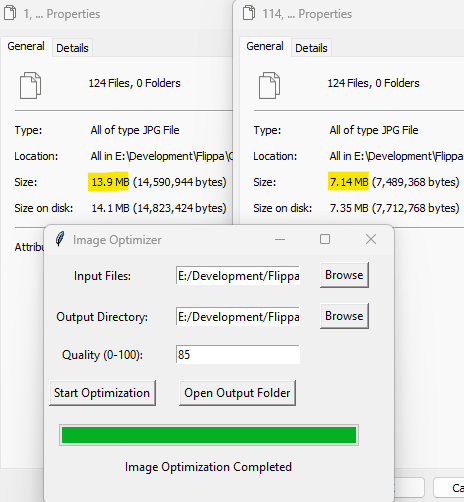

# Image Optimizer

Image Optimizer is a user-friendly tool to batch optimize JPEG and PNG images. Using a simple and intuitive graphical interface, users can select specific image files to be optimized, choose an output directory, and set the desired quality level. The application will then process the selected images, and the optimized versions will be saved in the chosen output directory. A progress bar and status message provide real-time feedback on the optimization process.

## Motivation

The inspiration behind creating this application came from a real need to streamline the process of image optimization. Working with multiple images frequently required online tools that were cumbersome, requiring multiple uploads and downloads. Image Optimizer saves a significant amount of time and eliminates the need to rely on various online optimizers. Everything needed is in one simple, self-contained application, providing a much more efficient workflow.

## Features

- **Batch Processing**: Optimize multiple images at once.
- **Quality Control**: Set the desired quality level for optimization.
- **Progress Bar**: Visually track the progress of the optimization.
- **Output Folder Access**: Easily open the output folder right from the application after the optimization is complete.
- **User-friendly GUI**: Simple and intuitive graphical interface for ease of use.

## Requirements

- Python 3.x
- PIL (Pillow)

## Installation

1. Clone the repository:
`git clone https://github.com/1NoobDev/image-optimizer.git`

2. Install the required packages:
`pip install pillow`

## Usage
Run the script image_optimizer.py:
`python image_optimizer.py`

- **Input Directory**: Browse and select the directory containing the images to be optimized.
- **Output Directory**: Browse and select the directory where the optimized images will be saved.
- **Quality**: Enter the desired quality level for the images (0-100).
- **Start Optimization**: Click to begin the optimization process.
- **Open Output Folder**: Click to open the output folder and see the results.

## License
This project is licensed under the MIT License - see the LICENSE.md file for details.

## Contributing
Contributions are welcome! Feel free to open an issue or submit a pull request.

## Acknowledgements
Thanks to the community for feedback and support.
